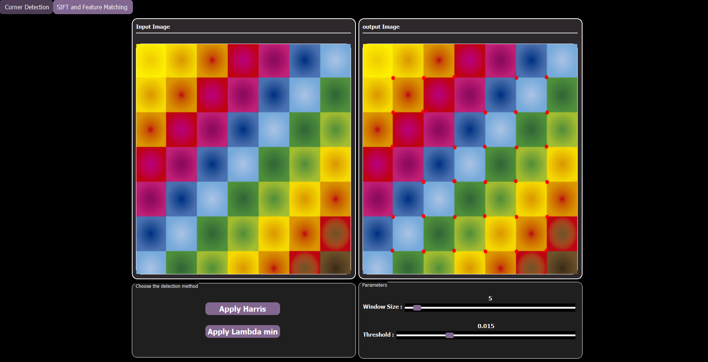
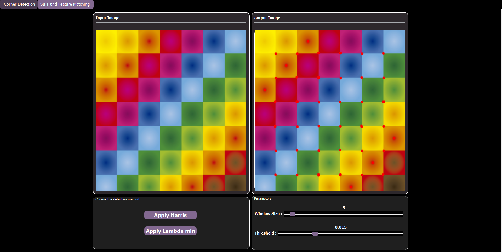
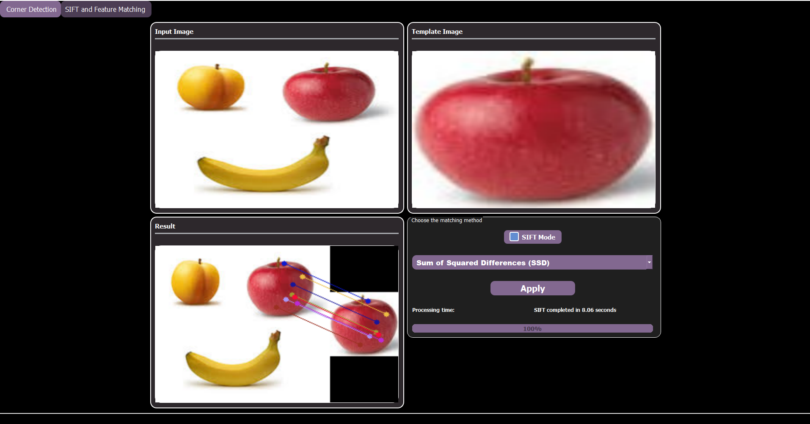

# Corner Detection, Feature Descriptor, and Matching

## Overview
It demonstrates the implementation of fundamental **feature detection and matching algorithms** — including **Harris Corner Detection**, **Lambda-Min**, and **SIFT-based matching** — from scratch using **Python and PyQt5**.  

The application provides an intuitive **Graphical User Interface (GUI)** that enables users to visualize corner detection and feature matching between images, explore algorithm behavior under different parameters, and compare performance between matching methods such as **SSD** and **NCC**.


## Application Structure

### Main Tabs
The GUI includes **two main functional tabs**:

1. **Corner Detection**
   - Apply **Harris** or **λ-min (Lambda-Min)** corner detection methods.
   - Adjust parameters:
     - **Window Size:** Controls Gaussian smoothing kernel for gradient computation.
     - **Threshold:** Determines sensitivity for detecting strong corners.
   - Displays both **input** and **processed images** with detected corners.
  
    ## Demo

<p align="center">
  
</p>

<p align="center">
  <em>Figure: Harris Corener Detection "red points"</em>
</p>

<p align="center">
  
</p>

<p align="center">
  <em>Figure: Lamdda-min Detection (using same parameters to notice the difference between this method and Harris)</em>
</p>


2. **SIFT and Feature Matching**
   - Perform **scale-invariant feature extraction** and **matching** between two images.
   - Upload input and template images by double-clicking on the widgets.
   - Choose matching technique:
     - **Sum of Squared Differences (SSD)**
     - **Normalized Cross-Correlation (NCC)**
   - View processing time and progress bar during execution.
  
  <p align="center">
  
</p>

<p align="center">
  <em>Figure: SIFT & Feature Matching </em>
</p>

---

## Project Architecture

The system is modular and organized into **6 core classes** for clarity and reusability:

| Class | Description |
|-------|--------------|
| **ImageViewer** | Manages image uploading, display, and interaction in the GUI. Supports grayscale and color modes. |
| **CornerDetector** | Implements Harris and Lambda-Min corner detection with gradient computation, Gaussian smoothing, thresholding, and non-maximum suppression. |
| **SIFT** | Implements the full Scale-Invariant Feature Transform (SIFT) algorithm, including keypoint detection, orientation assignment, and descriptor generation (based on Lowe, 2004). |
| **NCCMatcher** | Performs template matching using **Normalized Cross-Correlation (NCC)** to locate a template within an image. |
| **SSDMatcher** | Performs template matching using **Sum of Squared Differences (SSD)**, optimized for speed and simplicity. |

---

## Key Features

- **Corner Detection:** Harris and Lambda-Min implementations for analyzing edge features.  
- **Parameter Control:** Real-time adjustment of window size and detection thresholds.  
- **SIFT Implementation:** Full custom implementation of the SIFT pipeline:
  1. Scale-space extrema detection  
  2. Keypoint localization  
  3. Orientation assignment  
  4. Descriptor generation  
- **Feature Matching:** Supports SSD and NCC algorithms for template matching.  
- **Performance Feedback:** Displays computation time and progress indicators.

---

## Technologies Used
- **Language:** Python  
- **Framework:** PyQt5  
- **Libraries:** NumPy, OpenCV, Matplotlib, PIL  

---

## Getting Started

### Prerequisites
Make sure you have Python 3.8+ installed.  
Install the required dependencies:

```bash
pip install numpy opencv-python PyQt5 matplotlib pillow
